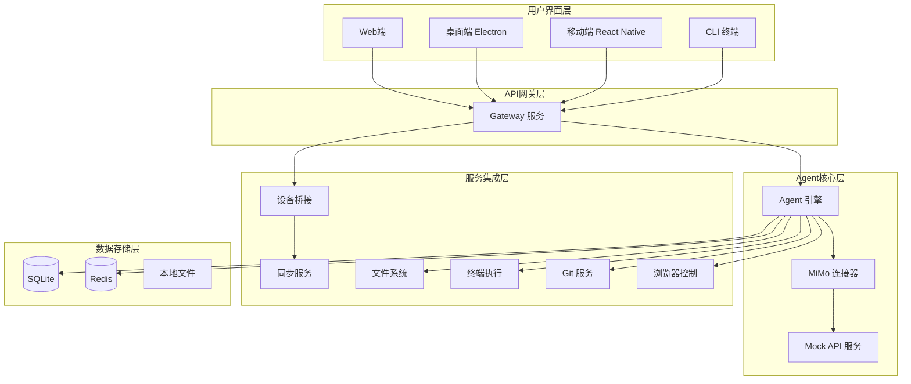
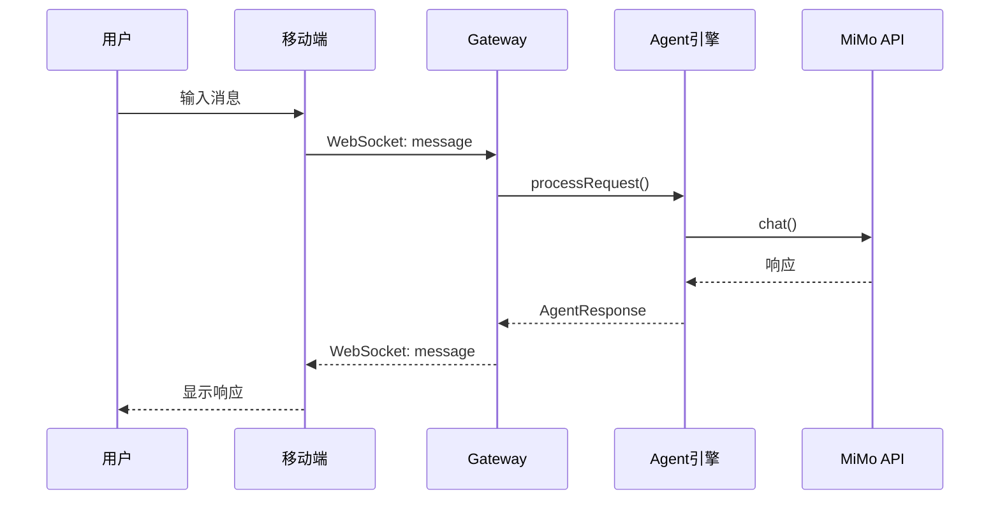

## 产品概述

按照 SPEC.md 完成 MiMo Agent Platform 所有功能开发，实现跨平台AI编程开发环境，支持移动端唤醒桌面端进行编程工作。

## 核心功能

- **Phase 1 - 核心框架**: 创建 Mock MiMo API 服务、独立 Gateway 服务、数据持久化基础（Prisma/SQLite）
- **Phase 2 - 桌面端完善**: Monaco Editor 完整集成、终端模拟器、项目文件树、多会话管理
- **Phase 3 - 移动端开发**: 推送通知（极光推送）、mDNS 设备发现、文件浏览器、代码查看器
- **Phase 4 - 跨设备协同**: Sync Service（状态同步、对话历史同步、冲突解决）、设备管理完善
- **Phase 5 - 工具系统完善**: Git 操作工具、浏览器控制工具、代码搜索实现、工具权限管理
- **Phase 6 - 测试与发布**: 单元测试、集成测试、API 文档、用户文档、打包发布

## 当前状态

项目完成度 45%，基础框架已搭建，需按 SPEC.md 6 个阶段完成剩余功能。

## 技术栈选型

### 后端服务

- **运行环境**: Node.js 20 LTS
- **HTTP 框架**: Express (Gateway 服务)
- **WebSocket**: Socket.IO
- **数据库**: SQLite + Prisma ORM
- **缓存**: Redis (可选，用于会话缓存)
- **认证**: JWT Token + API Key 验证

### 桌面端

- **框架**: Electron 28+
- **UI**: React 18 + TypeScript 5
- **编辑器**: Monaco Editor (@monaco-editor/react)
- **终端**: node-pty + xterm.js
- **状态管理**: Zustand
- **样式**: CSS Modules

### 移动端

- **框架**: React Native 0.73+
- **导航**: React Navigation 6
- **推送**: 极光推送 (jpush-react-native)
- **网络发现**: react-native-zeroconf (mDNS)
- **存储**: AsyncStorage

### 开发工具

- **构建**: Vite (桌面端/Web端)
- **类型检查**: TypeScript 5
- **代码规范**: ESLint + Prettier
- **测试**: Jest + React Testing Library

## 实施方案

### Phase 1: 核心框架完善（当前阶段）

#### 1.1 创建 Mock MiMo API 服务

**目标**: 在真实 API 可用前支持开发测试

**技术选型**:

- 使用 Express 创建独立 Mock 服务器
- 模拟 MiMo API 的 `/chat/completions`、`/completions`、`/embeddings` 端点
- 支持流式响应（SSE）和非流式响应
- 添加可配置延迟模拟真实 API

**实现要点**:

```typescript
// services/mock-api/server.ts
// 模拟 /chat/completions 端点
app.post('/chat/completions', (req, res) => {
  // 支持 stream 和 non-stream 模式
  // 返回模拟的 AI 响应
});
```

**目录结构**:

```
services/mock-api/
├── package.json
├── src/
│   ├── server.ts          # Express 服务器
│   ├── handlers/          # 请求处理器
│   │   ├── chat.ts       # /chat/completions
│   │   ├── completions.ts # /completions
│   │   └── embeddings.ts # /embeddings
│   ├── mock-data/        # 模拟数据
│   └── index.ts          # 入口文件
└── tsconfig.json
```

#### 1.2 Gateway 服务独立实现

**目标**: 从 `apps/desktop/src/main/server.ts` 分离出独立网关服务

**技术选型**:

- Express/Fastify 作为 HTTP 服务器
- Socket.IO 作为 WebSocket 网关
- 使用 `helmet` 进行安全加固
- 使用 `express-rate-limit` 进行限流
- 使用 `winston` 进行日志记录

**核心功能**:

1. **REST API 路由**:

- `POST /api/v1/chat` - 聊天请求
- `GET /api/v1/sessions` - 获取会话列表
- `POST /api/v1/sessions` - 创建会话
- `GET /api/v1/devices` - 获取设备列表
- `POST /api/v1/files` - 文件操作
- `POST /api/v1/terminal` - 终端命令执行

2. **WebSocket 事件**:

- `join` - 加入会话/设备房间
- `message` - 发送消息
- `tool` - 执行工具
- `sync` - 状态同步

3. **中间件**:

- 认证中间件（API Key / JWT）
- 限流中间件（防止滥用）
- 日志中间件（记录请求）
- 错误处理中间件

**目录结构**:

```
services/gateway/
├── package.json
├── src/
│   ├── index.ts              # 入口文件
│   ├── app.ts               # Express 应用配置
│   ├── server.ts            # HTTP + WebSocket 服务器
│   ├── routes/              # REST API 路由
│   │   ├── chat.ts
│   │   ├── sessions.ts
│   │   ├── devices.ts
│   │   └── files.ts
│   ├── middleware/          # 中间件
│   │   ├── auth.ts
│   │   ├── rate-limit.ts
│   │   └── logger.ts
│   ├── websocket/          # WebSocket 处理
│   │   ├── connection.ts
│   │   └── events.ts
│   └── types/              # 类型定义
└── tsconfig.json
```

#### 1.3 数据持久化基础

**目标**: 集成 Prisma + SQLite 支持数据持久化

**技术选型**:

- Prisma 作为 ORM
- SQLite 作为本地数据库
- 定义数据模型：Session、Project、Message、Device、File

**数据模型设计**:

```
// prisma/schema.prisma
model Session {
  id          String   @id @default(cuid())
  deviceId    String
  userId      String   @default("local")
  projectPath String?
  startedAt   DateTime
  lastActivity DateTime
  context     Json?
  messages    Message[]
}

model Message {
  id        String   @id @default(cuid())
  sessionId String
  session   Session   @relation(fields: [sessionId], references: [id])
  role      String    // 'user' | 'assistant' | 'system'
  content   String
  timestamp DateTime
  metadata  Json?
}

model Project {
  id          String   @id @default(cuid())
  name        String
  path        String   @unique
  lastOpened  DateTime
  files       ProjectFile[]
}

model Device {
  id           String   @id @default(cuid())
  deviceId     String   @unique
  name         String
  platform     String   // 'windows' | 'macos' | 'linux' | 'android' | 'ios'
  type         String   // 'desktop' | 'mobile'
  status       String   // 'connected' | 'disconnected'
  lastSeen     DateTime
  capabilities Json?
}
```

**实现要点**:

- 创建 `packages/core/database` 模块封装 Prisma 操作
- 实现会话持久化（创建、读取、更新、删除）
- 实现消息历史持久化
- 实现设备信息持久化

### Phase 2: 桌面端完善

#### 2.1 Monaco Editor 完整集成

**目标**: 实现完整的代码编辑器功能

**技术选型**:

- `@monaco-editor/react` 组件
- Monaco Editor API 进行高级定制

**功能清单**:

1. **多标签页支持**: 同时编辑多个文件
2. **语法高亮**: 自动检测文件类型
3. **自动保存**: 防抖保存，避免频繁写入
4. **代码补全**: 集成 MiMo API 的代码补全功能
5. **查找替换**: Ctrl+F 查找，Ctrl+H 替换
6. **最小化地图**: 右侧代码预览
7. **主题切换**: 亮色/暗色主题

**关键组件**:

```
// apps/desktop/src/renderer/components/EditorPanel.tsx
<MonacoEditor
  language={detectLanguage(filePath)}
  value={fileContent}
  onChange={handleChange}
  options={{
    minimap: { enabled: true },
    automaticLayout: true,
    fontSize: 14,
  }}
/>
```

#### 2.2 终端模拟器完善

**目标**: 实现完整的终端模拟功能

**技术选型**:

- `node-pty` 创建真实终端会话
- `xterm.js` 作为前端终端 UI
- `xterm-addon-fit` 自适应大小
- `xterm-addon-web-links` 链接点击

**功能清单**:

1. **多终端标签**: 创建/关闭/切换终端
2. **命令执行**: 真实的 shell 环境
3. **颜色支持**: 支持 ANSI 颜色代码
4. **光标定位**: 支持鼠标点击定位光标
5. **复制粘贴**: 右键菜单和快捷键

#### 2.3 项目文件树

**目标**: 实现项目文件浏览和管理

**功能清单**:

1. **文件树展示**: 递归展示项目结构
2. **文件操作**: 新建、重命名、删除文件/文件夹
3. **搜索文件**: 快速搜索文件名
4. **Git 状态**: 显示文件的 Git 状态（修改、新增、删除）

### Phase 3: 移动端开发

#### 3.1 推送通知集成

**目标**: 实现移动端推送通知功能

**技术选型**:

- 极光推送 (jpush-react-native)
- 处理通知点击唤醒应用

**功能清单**:

1. **初始化推送**: 应用启动时初始化极光推送
2. **接收通知**: 处理接收到的推送通知
3. **点击通知**: 点击通知唤醒应用并跳转到对应界面
4. **本地通知**: 应用内本地通知（如任务完成提醒）

#### 3.2 mDNS 设备发现

**目标**: 实现局域网内设备自动发现

**技术选型**:

- `react-native-zeroconf` 进行 mDNS 发现

**功能清单**:

1. **自动发现**: 扫描局域网内的桌面端设备
2. **手动添加**: 手动输入 IP 地址连接
3. **连接管理**: 保存常用连接，快速重连

#### 3.3 移动端功能完善

**功能清单**:

1. **文件浏览器**: 查看桌面端项目文件
2. **代码查看器**: 语法高亮的代码查看
3. **快速命令**: 预设命令快捷执行（如启动开发服务器）
4. **实时状态**: 查看桌面端当前状态（正在编辑的文件、运行的任务等）

### Phase 4: 跨设备协同

#### 4.1 Sync Service 实现

**目标**: 实现跨设备状态同步

**功能清单**:

1. **状态同步**: 同步编辑器状态、光标位置、选中内容
2. **对话历史同步**: 在多设备间同步 AI 对话历史
3. **项目状态同步**: 同步打开的项目、文件树展开状态等
4. **冲突解决**: 当多个设备同时修改时的冲突处理策略

**实现方案**:

- 使用 WebSocket 实时同步
- 使用操作日志（Operation Log）记录每次修改
- 使用 CRDT 算法解决冲突

#### 4.2 设备管理完善

**功能清单**:

1. **心跳检测**: 定期检测设备是否在线
2. **设备能力协商**: 根据设备能力调整可用功能
3. **会话迁移**: 将会话从一个设备迁移到另一个设备

### Phase 5: 工具系统完善

#### 5.1 工具系统补全

**功能清单**:

1. **文件操作工具**:

- `create_file` - 创建文件
- `delete_file` - 删除文件
- `move_file` - 移动/重命名文件
- `copy_file` - 复制文件

2. **代码搜索工具**:

- `search_files` - 使用 ripgrep 搜索文件内容
- `search_code` - 语义代码搜索（使用嵌入向量）

3. **Git 操作工具**:

- `git_status` - 查看仓库状态
- `git_diff` - 查看差异
- `git_commit` - 提交修改
- `git_push` - 推送到远程
- `git_pull` - 拉取远程更新

4. **浏览器控制工具**:

- `browser_navigate` - 打开网页
- `browser_click` - 点击元素
- `browser_type` - 输入文本
- `browser_screenshot` - 截图

#### 5.2 工具权限和安全

**功能清单**:

1. **工具权限配置**: 用户可配置文件哪些工具可用
2. **沙箱执行**: 命令执行在沙箱中运行，避免系统破坏
3. **危险操作确认**: 删除文件、执行危险命令前需用户确认

### Phase 6: 测试与发布

#### 6.1 测试

**测试清单**:

1. **单元测试**:

- Agent 引擎测试
- 工具函数测试
- MiMo 连接器测试

2. **集成测试**:

- 端到端流程测试（移动端唤醒桌面端 → 发送消息 → 接收响应）
- API 接口测试

3. **性能测试**:

- 响应时间测试
- 内存使用测试
- 大文件处理测试

#### 6.2 文档

**文档清单**:

1. **API 文档**: REST API 和 WebSocket API 文档
2. **用户文档**: 使用指南、常见问题
3. **开发者文档**: 如何贡献代码、架构说明

#### 6.3 发布准备

**发布清单**:

1. **桌面端打包**: 使用 electron-builder 打包 Windows、macOS、Linux 安装包
2. **移动端构建**: Android APK、iOS 打包
3. **Docker 镜像**: 完善 Docker 配置，支持容器化部署
4. **CI/CD**: 配置 GitHub Actions 自动构建和发布

## 架构设计

### 系统架构图



### 数据流图



## 目录结构

### 完整项目结构（所有阶段完成后）

```
mimo/
├── apps/
│   ├── desktop/                 # Electron桌面应用
│   │   ├── src/
│   │   │   ├── main/           # 主进程
│   │   │   │   ├── index.ts    # 主进程入口
│   │   │   │   └── server.ts  # Agent服务器（开发模式使用Mock）
│   │   │   ├── renderer/       # 渲染进程
│   │   │   │   ├── App.tsx    # 主应用组件
│   │   │   │   ├── main.tsx   # 渲染进程入口
│   │   │   │   ├── components/
│   │   │   │   │   ├── ChatPanel.tsx      [修改] 聊天界面
│   │   │   │   │   ├── EditorPanel.tsx    [修改] 代码编辑器，需完善Monaco集成
│   │   │   │   │   ├── TerminalPanel.tsx  [修改] 终端模拟器，需集成node-pty
│   │   │   │   │   ├── DevicePanel.tsx    [修改] 设备管理界面
│   │   │   │   │   ├── SettingsModal.tsx  [修改] 设置界面
│   │   │   │   │   └── FileTree.tsx      [新增] 项目文件树组件
│   │   │   │   ├── store.ts               [修改] Zustand状态管理，需添加文件树状态
│   │   │   │   └── types/
│   │   │   └── preload/        # 预加载脚本
│   │   │       └── index.ts    # IPC桥接
│   │   ├── package.json
│   │   ├── vite.config.ts
│   │   └── electron-builder.yml  [新增] 打包配置
│   │
│   ├── mobile/                  # React Native移动应用
│   │   ├── App.tsx             [修改] 主应用组件，需完善导航和屏幕
│   │   ├── package.json
│   │   ├── src/
│   │   │   ├── screens/        [新增] 屏幕组件
│   │   │   │   ├── HomeScreen.tsx
│   │   │   │   ├── ChatScreen.tsx
│   │   │   │   ├── FileBrowserScreen.tsx
│   │   │   │   └── SettingsScreen.tsx
│   │   │   ├── components/     [新增] 组件
│   │   │   │   ├── DeviceList.tsx
│   │   │   │   ├── MessageBubble.tsx
│   │   │   │   └── CodeViewer.tsx
│   │   │   └── services/       [新增] 服务
│   │   │       ├── PushNotification.ts  [新增] 推送通知服务
│   │   │       └── MDNSDiscovery.ts    [新增] mDNS发现服务
│   │   └── android/            [新增] Android原生代码
│   │
│   ├── cli/                     # 命令行工具
│   │   ├── src/
│   │   │   └── index.ts        [修改] CLI入口，需完善search和devices命令
│   │   └── package.json
│   │
│   └── web/                     # Web版本
│       ├── src/
│       │   └── App.tsx         [修改] Web应用，需完善路由和功能
│       └── package.json
│
├── packages/
│   ├── core/                    # 核心库
│   │   ├── agent/              # Agent引擎
│   │   │   └── src/
│   │   │       └── index.ts    [修改] Agent引擎，需添加多步骤任务分解
│   │   ├── gateway/            [新增] 网关服务核心逻辑
│   │   │   └── src/
│   │   │       ├── index.ts
│   │   │       ├── router.ts
│   │   │       └── auth.ts
│   │   ├── sync/               [新增] 同步服务
│   │   │   └── src/
│   │   │       ├── index.ts
│   │   │       ├── state-sync.ts
│   │   │       └── conflict-resolution.ts
│   │   └── database/           [新增] 数据库操作封装
│   │       └── src/
│   │           ├── index.ts
│   │           └── prisma-client.ts
│   │
│   ├── shared/                  # 共享模块
│   │   ├── types/              # 类型定义
│   │   │   └── index.ts        [修改] 添加缺失类型（Project, SyncState等）
│   │   └── utils/             # 工具函数
│   │       └── index.ts        [修改] 添加缺失工具函数
│   │
│   ├── mimo-connector/         # MiMo连接器
│   │   └── src/
│   │       └── index.ts        [已完成] MiMo API连接器
│   │
│   └── device-bridge/         # 设备桥接
│       └── src/
│           └── index.ts        [修改] 添加心跳检测、mDNS发现
│
├── services/                    # 后端服务
│   ├── mock-api/               [新增] Mock MiMo API服务
│   │   ├── package.json
│   │   └── src/
│   │       ├── server.ts       # Express服务器
│   │       ├── handlers/
│   │       │   ├── chat.ts
│   │       │   ├── completions.ts
│   │       │   └── embeddings.ts
│   │       └── mock-data/
│   │
│   ├── gateway/                [新增] 独立Gateway服务
│   │   ├── package.json
│   │   └── src/
│   │       ├── index.ts
│   │       ├── app.ts
│   │       ├── server.ts
│   │       ├── routes/
│   │       ├── middleware/
│   │       └── websocket/
│   │
│   └── notification/           [新增] 通知服务
│       ├── package.json
│       └── src/
│           └── index.ts
│
├── prisma/                     [新增] Prisma配置
│   ├── schema.prisma           [新增] 数据模型定义
│   └── migrations/             [新增] 数据库迁移文件
│
├── docs/                        # 文档
│   ├── architecture/           [新增] 架构文档
│   │   └── overview.md
│   ├── api/                    [新增] API文档
│   │   ├── rest-api.md
│   │   └── websocket-api.md
│   └── guides/                 [新增] 使用指南
│       ├── getting-started.md
│       └── user-guide.md
│
├── configs/                     # 配置文件 [新增]
│   ├── eslint/
│   ├── prettier/
│   └── typescript/
│
├── scripts/                     # 构建脚本 [新增]
│   ├── build.sh
│   └── deploy.sh
│
├── .env.example                [修改] 添加数据库连接等配置
├── docker-compose.yml         [修改] 更新服务依赖
├── package.json               [修改] 添加services到workspaces
├── README.md                  [修改] 更新项目说明
└── SPEC.md                   [已完成] 产品需求规范
```

## 关键代码结构

### Mock MiMo API 服务

```typescript
// services/mock-api/src/server.ts
import express from 'express';
import { Server as HttpServer } from 'http';
import cors from 'cors';

export class MockMiMoServer {
  private app: Express;
  private server: HttpServer;
  
  constructor(private port: number) {
    this.app = express();
    this.server = new HttpServer(this.app);
    this.setupMiddleware();
    this.setupRoutes();
  }
  
  private setupMiddleware() {
    this.app.use(cors());
    this.app.use(express.json());
  }
  
  private setupRoutes() {
    // 聊天补全接口
    this.app.post('/chat/completions', this.handleChatCompletions.bind(this));
    
    // 代码补全接口
    this.app.post('/completions', this.handleCompletions.bind(this));
    
    // 嵌入向量接口
    this.app.post('/embeddings', this.handleEmbeddings.bind(this));
  }
  
  private async handleChatCompletions(req: Request, res: Response) {
    const { messages, stream } = req.body;
    
    if (stream) {
      // SSE 流式响应
      res.setHeader('Content-Type', 'text/event-stream');
      res.setHeader('Cache-Control', 'no-cache');
      
      const mockResponse = "这是 Mock API 的模拟响应。\n\n";
      for (const char of mockResponse) {
        res.write(`data: ${JSON.stringify({ choices: [{ delta: { content: char } }] })}\n\n`);
        await new Promise(resolve => setTimeout(resolve, 50));
      }
      res.write('data: [DONE]\n\n');
      res.end();
    } else {
      // 非流式响应
      res.json({
        id: 'mock-' + Date.now(),
        model: 'mimo-pro',
        choices: [{
          message: {
            role: 'assistant',
            content: '这是 Mock API 的模拟响应。'
          },
          finish_reason: 'stop'
        }],
        usage: {
          prompt_tokens: 10,
          completion_tokens: 20,
          total_tokens: 30
        }
      });
    }
  }
  
  start(): Promise<void> {
    return new Promise((resolve) => {
      this.server.listen(this.port, () => {
        console.log(`Mock MiMo API server listening on port ${this.port}`);
        resolve();
      });
    });
  }
}
```

### Gateway 服务

```typescript
// services/gateway/src/app.ts
import express from 'express';
import cors from 'cors';
import helmet from 'helmet';
import morgan from 'morgan';
import rateLimit from 'express-rate-limit';

export function createApp() {
  const app = express();
  
  // 安全中间件
  app.use(helmet());
  app.use(cors());
  
  // 日志中间件
  app.use(morgan('dev'));
  
  // 解析中间件
  app.use(express.json());
  app.use(express.urlencoded({ extended: true }));
  
  // 限流中间件
  const limiter = rateLimit({
    windowMs: 15 * 60 * 1000, // 15分钟
    max: 100 // 最多100个请求
  });
  app.use(limiter);
  
  // 认证中间件
  app.use('/api', async (req, res, next) => {
    const apiKey = req.headers['x-api-key'];
    if (!apiKey) {
      return res.status(401).json({ error: 'Missing API key' });
    }
    // 验证 API Key...
    next();
  });
  
  // 路由
  app.get('/health', (req, res) => {
    res.json({ status: 'ok' });
  });
  
  app.use('/api/v1/chat', require('./routes/chat').default);
  app.use('/api/v1/sessions', require('./routes/sessions').default);
  app.use('/api/v1/devices', require('./routes/devices').default);
  
  // 错误处理
  app.use((err, req, res, next) => {
    console.error(err);
    res.status(500).json({ error: 'Internal server error' });
  });
  
  return app;
}
```

### 数据模型

```
// prisma/schema.prisma
generator client {
  provider = "prisma-client-js"
}

datasource db {
  provider = "sqlite"
  url      = env("DATABASE_URL")
}

model Session {
  id          String   @id @default(cuid())
  deviceId    String
  userId      String   @default("local")
  projectPath String?
  startedAt   DateTime @default(now())
  lastActivity DateTime @default(now())
  context     String?   @db.Json
  
  messages    Message[]
  
  @@map("sessions")
}

model Message {
  id        String   @id @default(cuid())
  sessionId String
  session   Session  @relation(fields: [sessionId], references: [id], onDelete: Cascade)
  role      String
  content   String
  timestamp DateTime @default(now())
  metadata  String?  @db.Json
  
  @@map("messages")
}

model Project {
  id          String   @id @default(cuid())
  name        String
  path        String   @unique
  lastOpened  DateTime @default(now())
  
  files       ProjectFile[]
  
  @@map("projects")
}

model ProjectFile {
  id        String   @id @default(cuid())
  projectId String
  project   Project  @relation(fields: [projectId], references: [id], onDelete: Cascade)
  path      String
  content   String?
  modified  DateTime @default(now())
  
  @@unique([projectId, path])
  @@map("project_files")
}

model Device {
  id           String   @id @default(cuid())
  deviceId     String   @unique
  name         String
  platform     String
  type         String
  status       String   @default("disconnected")
  lastSeen     DateTime @default(now())
  capabilities String?  @db.Json
  
  @@map("devices")
}
```

## 实施要点

### 性能优化

1. **消息历史压缩**: 当消息数量超过阈值时，压缩早期消息以节省 Token
2. **文件读取缓存**: 缓存最近读取的文件内容，减少磁盘 I/O
3. **WebSocket 心跳优化**: 使用 ping/pong 机制检测连接状态，避免频繁轮询
4. **数据库查询优化**: 使用索引加速查询，分页加载历史消息

### 安全措施

1. **API 认证**: 所有 API 请求必须携带有效的 API Key 或 JWT Token
2. **输入验证**: 使用 Zod 等库验证所有用户输入
3. **命令执行沙箱**: 使用 Docker 或 VM 隔离命令执行环境
4. **敏感信息加密**: API Key、用户数据等敏感信息加密存储

### 错误处理

1. **统一错误格式**: 所有错误响应使用统一格式
2. **错误日志**: 记录详细的错误日志，便于调试
3. **用户友好提示**: 向用户展示友好的错误提示，而非技术细节
4. **自动重试**: 对于临时性错误（如网络超时），自动重试

## 测试策略

### 单元测试

- 使用 Jest 编写单元测试
- 测试覆盖率目标：80% 以上
- 重点测试核心逻辑（Agent 引擎、工具执行等）

### 集成测试

- 测试端到端流程
- 测试不同模块之间的交互
- 使用真实或模拟的 MiMo API

### E2E 测试

- 使用 Playwright 或 Cypress 进行 Web 端 E2E 测试
- 测试关键用户流程（如：唤醒设备 → 发送消息 → 接收响应）